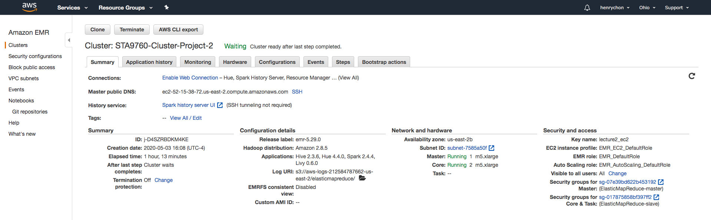
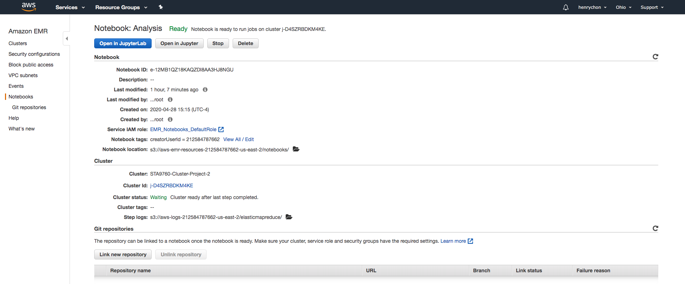

# Data Analysis of Yelp Business Data

In this project, I will be analyzing a subset of Yelp's business, reviews and user data. The dataset comes from <a href='https://www.kaggle.com/yelp-dataset/yelp-dataset#yelp_academic_dataset_business.json'>Kaggle</a>. I pulled the data into a publis s3 bucket: s3://sta9760-project2-yelp-data/\*.json

<h2><a href='/Analysis.ipynb'>Analysis</a></h2>

 
 

<h2>Cluster Configs</h2>

<h2>Notebook Configs</h2>

